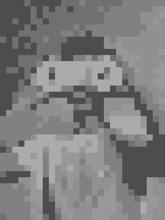

# Exact covers, Algorithm X, and Lego

## No dice

You may have come across examples of people online making pictures with dice, like the ones below. I had, and I was interested in trying something similar myself. 

| | |
|---|---|
| <iframe id="reddit-embed" src="https://www.redditmedia.com/r/Damnthatsinteresting/comments/rxdh0b/dice_art/?ref_source=embed&amp;ref=share&amp;embed=true" sandbox="allow-scripts allow-same-origin allow-popups" style="border: none;" height="620" width="640" scrolling="no"></iframe> <iframe id="reddit-embed" src="https://www.redditmedia.com/r/nextfuckinglevel/comments/jhuq2e/using_dice_to_create_art_is_extraordinary/?ref_source=embed&amp;ref=share&amp;embed=true" sandbox="allow-scripts allow-same-origin allow-popups" style="border: none;" height="620" width="640" scrolling="no"></iframe> | <iframe id="reddit-embed" src="https://www.redditmedia.com/r/DIY/comments/a411hu/i_made_a_portrait_of_a_friend_out_of_13000_dice/?ref_source=embed&amp;ref=share&amp;embed=true" sandbox="allow-scripts allow-same-origin allow-popups" style="border: none;" height="1274" width="640" scrolling="no"></iframe> |

Being a software developer, half of the fun for me lay in writing a program to turn pictures into solutions _for_ me. Making pictures with dice is actually fairly straightfoward, since each die is effectively a single pixel. Finding a "solution" (what I'm going to call the output of these programs that tell me where to put things) is a case of:
1. Finding a picture
2. Scaling it to a resolution that you have enough dice to cover (a resolution of 4x4 would require 16 dice)
3. Switching to grayscale (you could leave it in colour if you had a big bag of coloured dice, but lets assume regular black and white dice for now)
4. Decreasing the colour *depth* to 6. Colour depth is the number of different colours in the image, so by reducing a grayscale image's colour depth to 6, we end up with 6 shades of white, black, and gray.
5. Map each of the 6 colours to one of the numbers on the dice
6. Done!

Here's an example with a stock photo:

| | |
| :---: | :---: |
| The original image:<br/> | Scaled to a lower resolution:<br/> |
| Switched to grayscale:<br/> | Drop the colour depth:<br/> |

The solution output would then look something like:
```
1	1	1	1	1	1	5	1	1	1	...
1	1	1	1	1	1	1	1	1	1	...
1	1	1	5	1	1	5	5	1	1	...
1	1	1	1	1	5	1	1	1	5	...
5	1	1	1	5	5	1	5	1	5	...
1	5	5	5	1	5	5	1	1	5	...
...
```

As someone building one of these images, you'd then take the grid of numbers, place each die with the correct value facing upwards and you'd be done. The pieces of art that people have created with dice are really impressive, but as someone looking for a fun programming project (and someone who seems to enjoy making life hard for himself), dice felt too easy. I tossed the dice idea and went looking for something more interesting. I eventually landed on Lego.

Making pixel art with Lego is more *interesting* than dice for a few reasons:
- The pieces are all different sizes
- Each piece can only be a single colour, unlike dice, where a single die can be changed to any of the six colours by rotating it
- The *orientation* of the pieces matters. Placing bricks vertically and horizontally changes how they cover the image

## How exactly do we cover the picture?

### Exact covers!

I rushed headfirst into my implementation, only to realise very quickly that placing the Lego bricks was a more complex task that I'd initially anticipated. I had, however, already gone out and bought a 1kg bag of "Lego" bricks, so I was committed. I haven't come across examples online of people solving the Lego pixel art problem, but the problem didn't seem unique enough that some abstraction of the same problem wouldn't have been solved. My first clue as to what problem I was actually solving came when I encountered [polyomino](https://en.wikipedia.org/wiki/Polyomino) puzzles, which involve placing a set of polyominos in a rectangle:


*Donald Knuth [arXiv:cs/0011047](https://arxiv.org/abs/cs/0011047) [cs.DS]*

> If this looks a little like Tetris, that's because the pieces in Tetris are [*tetrominoes*](https://en.wikipedia.org/wiki/Tetromino), which are polyominos, but only made up of four squares. Another type of polyomino you'll likely be familiar with are dominoes, which are made up of two squares.

The polyomino puzzle can be generalized to an [exact cover problem](https://en.wikipedia.org/wiki/Exact_cover). The Wikipedia definition of an exact cover is fairly dense:

> Given a collection S of subsets of a set X, an exact cover is a subcollection S* of S such that each element in X is contained in exactly one subset in S*. One says that each element in X is covered by exactly one subset in S*.

Let's take a look at a specific example to make sense of the definition. Take the matrix below (I've numbered the rows to make them easier to refer to):

```
1 -> | 0 | 0 | 0 | 1 |
2 -> | 0 | 1 | 1 | 1 |
3 -> | 0 | 1 | 0 | 1 |
4 -> | 1 | 0 | 1 | 0 |
```

To find an *exact cover*, we need to select some of the rows from the matrix so that in our selection of rows, there is exactly one 1 in each column. In this case, we can take rows 3 and 4:

```
3 -> | 0 | 1 | 0 | 1 |
4 -> | 1 | 0 | 1 | 0 |
```

Tying this back into the definition from Wikipedia,
- `S` is the set of all four rows: `{| 0 | 0 | 0 | 1 |, | 0 | 1 | 1 | 1 |, | 0 | 1 | 0 | 1 |, | 1 | 0 | 1 | 0 |}`
- `X` is our desired end state: `| 1 | 1 | 1 | 1 |`
- `S*` is the set containing rows 3 and 4: `{| 0 | 1 | 0 | 1 |, | 1 | 0 | 1 | 0 |}`

### Generalized tetrominos

Now that we've covered exactly what an exact cover is, let's take a look at how we can generalize other types of puzzles to the exact same "pick some rows" problem that we discussed above. Let's say we have a 4x4 grid and we want to fill it with *monominoes* (1x1 polyominoes):


Let's give each row in the grid a letter and each column a number. We'll also put a `1` in every grid cell that we want covered (that's all of them):
```
    1   2
A | 1 | 1 |
B | 1 | 1 |
```

Now for the interesting bit: We lay out the grid's rows side-by-side to get a new one-dimensional matrix that describes the solution we want. Each column of this new matrix corresonds to one cell in the original grid (I've given the columns headings to make it clearer which cells they represent):

```
  A1   A2   B1   B2 
| 1  | 1  | 1  | 1  |
```

The last step to get back to our "pick some rows" problem is to take *every possible position* that we could place a monomino and make it a row in our new matrix (which I'll now call the *solution matrix*). If a given row corresponds to, say, a monomino being placed in cell A1 (like in the image below), that row will have a one in column A1 and 0 everywhere else. (We also remove the row of all ones, since that's our desired solution and not actually part of the puzzle)


```
  A1   A2   B1   B2 
| 1  | 0  | 0  | 0  | <-- A monomino in cell A1
| 0  | 1  | 0  | 0  | <-- A monomino in cell A2
| 0  | 0  | 1  | 0  | <-- A monomino in cell B1
| 0  | 0  | 0  | 1  | <-- A monomino in cell B2
```

Now, we're back to the same problem as earlier! In this specific example, we would actually pick *every* row to solve the problem. That makes sense, since we'll want to place a monomino in every possible position to completely cover the grid:


To solidify the process of creating new solution matrices, let's look at another 2x2 grid that we want to cover with 2x1 dominos (placed horizontally or vertically):


In this case, each row in the solution matrix will have *two* `1`s because each domino covers two cells in the grid. The two example piece placements `A` and `B` below, correspond to the solution matrix rows below:


```
  A1   A2   B1   B2 
| 1  | 0  | 1  | 0  | <-- Placement A
| 1  | 1  | 0  | 0  | <-- Placement B
```

If you squint at them, Lego pieces kinda look like polyominoes. To solve the lego placement problem, we generate the solution matrix in exactly the same way as for the example problems in this section. Actually iterating through all of the positions that Lego bricks could be placed takes some work, but we'll look at how I did that later.

## The secret ingredient: Algorithm X

### What is?

Now that we've covered how we can convert the problem of placing lego bricks on a grid into a full cover problem, let's take a look at the algorithm, *Algorithm X* that I used to solve that problem. Throughout this discussion, I find it useful to remember that all we're solving is that problem of picking a combination of rows that gets us a 1 in each column. If you're wondering about the algorithm's name:

> The following nondeterministic algorithm, which I will call algorithm X for lack of a better name, finds all solutions to the exact cover problem defined by any given matrix A of 0s and 1s.
> <p style="margin-left: 50px;">Donald Knuth</p>

Algorithm X is described as a recursive, nondeterministic, depth-first, backtracking algorithm:
- Recursive and depth first because we're going to pick a row to include in our solution, remove the other rows in the matrix that couldn't go along with it, and repeat the process on the new, smaller matrix.
- Nondeterministic because we pick the row randomly (though the set of options from which we pick is deterministic).
- Backtracking because when our depth-first attempt to find a solution bottoms out at an invalid one, we'll reverse our steps to the last valid solution and try again.

Here's a very wordy explanation of the steps involved in the algorithm:
1. Find the column `C` that contains the fewest `1`s (if there are multiple with the same number, pick the first). We could really do this with any of the columns, but using the column with the fewest ones tends to find solutions faster. 
  - If you find that the matrix has no columns at all, whatever is in the partial solution is your final solution!
  - On the other hand, if you find a column that has no `1`s, there's no valid solution with the matrix. Backtrack from here by reversing the steps you ran before this.
2. Column `C` with have one or more `1`s. Pick a row `R` that has one of those `1`s in `C`.
3. Now, we're going to see if we can find a solution that includes that includes row `R`, so add it to the *partial solution*. If we don't manage to find a solution that includes `R`, the algorithm will backtrack to here and we can try a different column.
4. If any rows other than `R` have `1`s values in the same columns as `R`, those rows can't be in a solution along with `R` because that solution would have two values for one of its columns. Remove all of those clashing rows.
5. Now that any column in which `R` has a `1`s has been removed, we don't need to check those columns again (there's nothing left to clash). Remove all columns in which `R` has a `1`s.
6. We now have a smaller matrix with one additional row in the partial solution. Repeat from step 1 with the new matrix.

Implement that and you've got a solver for the exact cover problem that we discussed earleir. If you want to get a little more in-depth, here's the pseudocode lifted from Knuth's Paper:

```
// For a matrix A

If A is empty, the problem is solved; terminate successfully.
Otherwise choose a column, c (deterministically).
Choose a row, r, such that A[r, c] = 1 (nondeterministically).
Include r in the partial solution.
For each j such that A[r, j] = 1,
  delete column j from matrix A;
  for each i such that A[i, j] = 1,
    delete row i from matrix A.
    Repeat this algorithm recursively on the reduced matrix A.
```

There are examples all over the internet of what this looks like in practice, but I'll include one here too to make the description a little more concrete. The diagram below shows the process of finding an exact cover for a 7x7 matrix. Each sub-graph (each time the matrix shrinks) is a recursive call to the solver.


1. The smallest number of `1`s in any column is 2. Column 1 is the first column with 2 `1`s, so choose it. 
2. We then pick one of the `1`s in column 1 randomly. In this case, we choose A. **We add A to the partial solution**. We then find any rows that clash with A and remove them by checking for 1s in the same columns as those in row A. Clashing `1`s are shown in red.
3. Remove all clashing rows and remove all columns in which A has a `1` to get a smaller solution matrix. Once again, select the column with the fewest `1`s. It's column 2, which has no `1`s at all: this branch has no valid solutions. It's time to backtrack.
4. Add back all rows and columns in the reverse order that they were removed to get back to the full matrix.
5. Continue stepping back up to the point at which we picked one of column 1's `1`s. **A is removed from the partial solution.**
6. We now pick another of the `1`s in column 1. This time, it's row B. **B is added to the partial solution.**
7. As before, find any clashing rows and columns and removed them.
8. Column 5 has the fewest `1`s, so pick it. It only has a single `1`, so we choose row D. **Row D is added to the partial solution.**
9. Find any clashing rows and columns and removed them.
10. Rows 2 and 7 both have a single `1`, so pick 2 since it's first. We then choose the only `1`, which is in row F. **Row F is added to the partial solution.**
11. Remove clashing rows.

At the end of that process, we ended up with a matrix that has no columns left, which means that our partial solution is a full cover! Our solution has rows B, D, and F and looks like:


### Dancing towards a solution

Once you've worked through Algorithm X, it seems like a fairly straightforward algorithm. If you looked no further and wrote a solution for it, you'd have a great solver for toy exact cover problems. The issue is that Algorithm X has exponential time complexity. We could give up and go find something else, but Knuth proposed a nice way to improve the algorithm's performance so that while it's theoretical time complexity is still abysmal, you might actually live to see a solution. That improvement is a sparse matrix implementation based on *Dancing Links* (DLX).

The premise of dancing links is that in a doubly-linked list, you can *cover* a node by removing references to it from its neighbouring nodes (effectively removing it from the list) while keeping the covered node's pointers intact. To replace the node, you simply reverse the process. The pseudocode looks like:

```
cover(node):
  node.prev.next = node.next
  node.next.prev = node.prev

uncover(node):
  node.next.prev = node
  node.prev.next = node
```

And here's a more visual representation over the cover operation on node B in an example doubly linked list:


A key observation in why DLX makes sense when implementing Algorithm X is that our solution matrix is mostly empty. Especially as the width of the solution matrix grows, we end up with rows that have a handful of 1s scattered through their thousands of columns. That makes Algorithm X super inefficient on a regular two-dimensional list because:
- The time complexity of counting 1s in a column is relative to the number of rows (and not the number of 1s) because we have to iterate through every row to check if the value is a 1
- If we *actually* remove rows and columns from the list, we have to shift every element after it forward one space. We then have to reverse that operation when adding the rows and columns back. In algorithm X, we spend a lot of time adding and removing rows and columns, so that really adds up, especially as we move towards much larger solution spaces.
- When we cover a row, we have to iterate through each column and check whether it has a one in the row being covered to figure out whether it needs to be covered in the first place. Similarly to counting 1s, having to iterate through the columns make the complexity scale with the size of the problem space size, instead of the number of clashing columns.
- The matrices just start to take up inordinate amounts of space. In one of the problems I attempted to solve, I had a solution matrix slightly larger than 1000x10000. If you want to copy the matrix to parallelise the problem (which you do want to do), you're going to run into memory issues pretty quick.

There are undoubtedly other ways to address the issues above, but DLX is one way to do so. The DLX solution to the exact cover problem uses a two-dimensional circular doubly-linked list. Here's an example of one of these matrices; note how we're not storing any `0`s. Just the ones:


With this type of matrix, if we want to find the next `1` to the right of the current node, instead of having to work our way through columns, checking each of them for a `1` in the right row, we can go straight there! Covering rows and colums is now also a lot more efficient, since we're just rearranging some pointers instead of shifting all of those rows. We also somewhat solve our space problem, since we're not longer storing all those useless `0`s. Counting is also more efficient with this approach, since it now has time complexity that's proportional to the number of `1`s in a column. 

Some extra bits:
- In the canonical implementation, the headers themselves are just nodes in the matrix that have a special flag set. I would highly recommend using that implementation. I learned the hard way that attempts to tidy it up will make one's life hard.
  - The primary advantage of the original approach is that you can re-use the exact same methods to work with headers as any other node.
- In addition to the pointers in the diagram above, all nodes also:
  - keep track of their row
  - have a pointer to their column header
- Counting `1`s in a column is faster with the sparse matrix, but it's *even* faster to just maintain the count in the header. 
- I found it interesting that, to get a value equivalent to the "height" of a regular matrix, you don't look for the column with the most nodes. Instead, you scan all columns for the one that has a node with the largest "row" value.

### How'd it go?

tl;dr not great. 

The algorithm works! It generates valid solutions. Unfortunately, however, there seem to be two hurdles to overcome if I want to actually get _good_ results. 

Firstly, there are many possible ways to place the lego bricks. Far too many for me to evaluate them manually. That means that I need some way of telling the algorithm which solutions are _better_ than others. This problem is akin to selecting a [fitness function](https://en.wikipedia.org/wiki/Fitness_function#:~:text=A%20fitness%20function%20is%20a,to%20achieving%20the%20set%20aims.) for a genetic algorithm and is particularly difficult. I worked through a few options, each of which used various weightings and combinations of the difference between the desired and actual colour for a given pixel and the distance of those pixels from the centre of the image. The error functions were all fairly naive and didn't give great results. Centre-weighting errors in particular was a poor-mans attempt at favouring correct colours in "more important" areas of the image. I suspect that outcomes could be significantly improved by using edge detection and minimizing contrast errors around those edges. 

Secondly, some images will just be better-suited to this lego brick tiling. If I've only got 90 studs worth of white bricks, an image that has more than 90 white pixels _cannot_ have all of the white pixels correct. There's an art to downscaling and reducing the colour depth of images. Investing more time in finding approaches that suit the final use-case could result in images that are fundamentally _easier_ to tile. 

Either way, here's one solution:


| | | |
| :---: | :---: | :---: |
| The original image:<br/> | The version that the algorithm tried to tile:<br/> |  The result:<br/> |

### Closing out

For now, I've pushed the mess of code that gave us the work of art above to GitHub. One day, when I'm motivated, I'll come back, clean it up, and hopefully implement some of the improvements that I think will get the results to a level that I'm happy with.