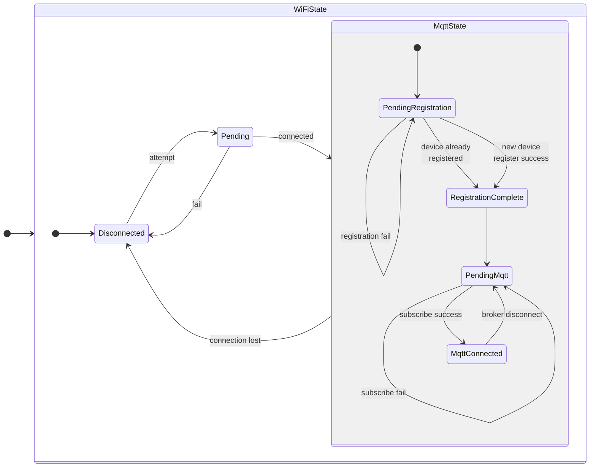

```mermaid
stateDiagram-v2
    direction LR
    [*] --> WiFiState
    state WiFiState {
    direction LR
        [*] --> Disconnected
        Disconnected --> Pending: attempt
        Pending --> MqttState: connected
        Pending --> Disconnected: fail
        MqttState --> Disconnected: connection lost
        state MqttState {
            [*] --> PendingRegistration
            PendingRegistration --> PendingRegistration: registration fail
            PendingRegistration --> RegistrationComplete: device already<br/>registered 
            PendingRegistration --> RegistrationComplete: new device <br/> register success

            RegistrationComplete --> PendingMqtt
            PendingMqtt --> PendingMqtt: subscribe fail
            PendingMqtt --> MqttConnected: subscribe success
            MqttConnected --> PendingMqtt: broker disconnect
        }
    }
```