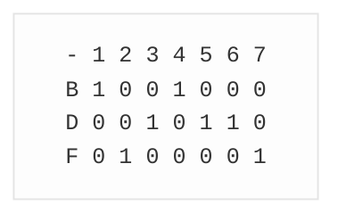

<!-- Mermaid doesn't work on GitHub pages AFAICT, so just pre-rendering this and dumping it here for now -->

```mermaid
%%{init: {'theme': 'base', 'themeVariables': { 'fontFamily': 'monospace', 'primaryColor': '#fdfdfd', 'fontSize': '13px' }}}%%
flowchart TD
  start["-  1 2 3 4 5 6 7\nB 1 0 0 1 0 0 0\nD 0 0 1 0 1 1 0\nF 0 1 0 0 0 0 1"]
```
